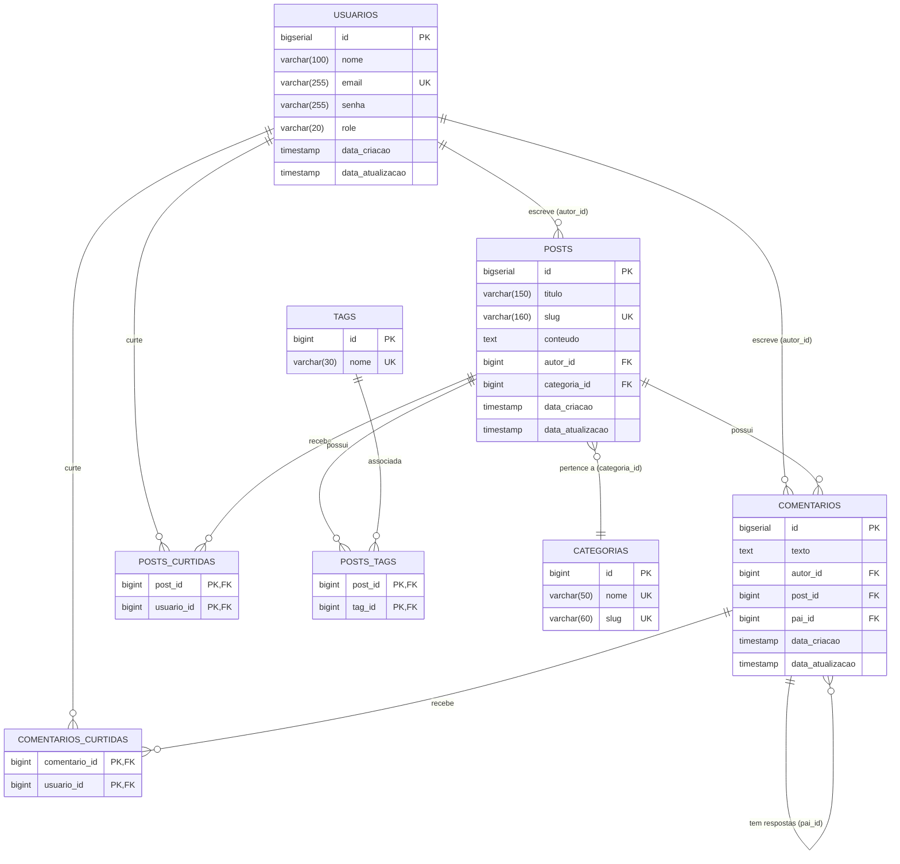

# 🗄️ Especificação Técnica: Banco de Dados & Migrações

Esta especificação descreve a modelagem relacional, estratégias de versionamento com Flyway, diagramas e suporte a múltiplos ambientes de banco de dados na **API Blog Pessoal**.

---

## 1. Diagrama Entidade-Relacionamento (ERD)

---

## 2. Dicionário de Dados das Tabelas

### 2.1 Tabela `usuarios`
Armazena os dados cadastrais de administradores e usuários do sistema.

| Coluna | Tipo | Restrições | Descrição |
| :--- | :--- | :--- | :--- |
| `id` | `BIGSERIAL` / `BIGINT` | `PK`, Auto-incremento | Identificador único do usuário |
| `nome` | `VARCHAR(100)` | `NOT NULL` | Nome completo do usuário |
| `email` | `VARCHAR(255)` | `NOT NULL`, `UNIQUE` | E-mail de login e contato |
| `senha` | `VARCHAR(255)` | `NOT NULL` | Senha de acesso |
| `role` | `VARCHAR(20)` | `NOT NULL` | Papel no sistema (`ADMIN` ou `USER`) |
| `data_criacao` | `TIMESTAMP` | `NOT NULL` | Data e hora do cadastro |
| `data_atualizacao` | `TIMESTAMP` | `NOT NULL` | Data e hora da última alteração |

### 2.2 Tabela `categorias`
Classificação temática primária das postagens.

| Coluna | Tipo | Restrições | Descrição |
| :--- | :--- | :--- | :--- |
| `id` | `BIGINT` | `PK`, Identity | Identificador único da categoria |
| `nome` | `VARCHAR(50)` | `NOT NULL`, `UNIQUE` | Nome legível da categoria |
| `slug` | `VARCHAR(60)` | `NOT NULL`, `UNIQUE` | Versão normalizada para URL (ex: `tecnologia`) |

### 2.3 Tabela `tags`
Palavras-chave e rótulos transversais para busca de posts.

| Coluna | Tipo | Restrições | Descrição |
| :--- | :--- | :--- | :--- |
| `id` | `BIGINT` | `PK`, Identity | Identificador único da tag |
| `nome` | `VARCHAR(30)` | `NOT NULL`, `UNIQUE` | Nome da tag (ex: `Java`, `Spring Boot`) |

### 2.4 Tabela `posts`
Artigos e postagens publicadas pelos autores.

| Coluna | Tipo | Restrições | Descrição |
| :--- | :--- | :--- | :--- |
| `id` | `BIGSERIAL` / `BIGINT` | `PK`, Auto-incremento | Identificador único do post |
| `titulo` | `VARCHAR(150)` | `NOT NULL` | Título da publicação |
| `slug` | `VARCHAR(160)` | `UNIQUE` | Slug amigável para SEO e rotas |
| `conteudo` | `TEXT` | `NOT NULL` | Corpo do post em texto/markdown |
| `autor_id` | `BIGINT` | `NOT NULL`, `FK(usuarios.id)` | Autor do post (deve ter role `USER`) |
| `categoria_id` | `BIGINT` | `NULLABLE`, `FK(categorias.id)` | Categoria vinculada ao post |
| `data_criacao` | `TIMESTAMP` | `NOT NULL` | Data de publicação |
| `data_atualizacao` | `TIMESTAMP` | `NOT NULL` | Data da última alteração |

### 2.5 Tabela `comentarios`
Comentários e respostas encadeadas (*Threaded Comments*).

| Coluna | Tipo | Restrições | Descrição |
| :--- | :--- | :--- | :--- |
| `id` | `BIGSERIAL` / `BIGINT` | `PK`, Auto-incremento | Identificador do comentário |
| `texto` | `TEXT` | `NOT NULL` | Conteúdo da mensagem |
| `autor_id` | `BIGINT` | `NOT NULL`, `FK(usuarios.id)` | Autor do comentário |
| `post_id` | `BIGINT` | `NOT NULL`, `FK(posts.id) ON DELETE CASCADE` | Post relacionado |
| `pai_id` | `BIGINT` | `NULLABLE`, `FK(comentarios.id) ON DELETE CASCADE` | Comentário pai caso seja uma resposta |
| `data_criacao` | `TIMESTAMP` | `NOT NULL` | Data e hora do comentário |
| `data_atualizacao` | `TIMESTAMP` | `NOT NULL` | Data da última alteração |

### 2.6 Tabelas Associativas
- **`posts_tags`**: `(post_id, tag_id)` com `ON DELETE CASCADE` para ambas as chaves.
- **`posts_curtidas`**: `(post_id, usuario_id)` com `ON DELETE CASCADE`, garantindo 1 curtida por usuário por post.
- **`comentarios_curtidas`**: `(comentario_id, usuario_id)` com `ON DELETE CASCADE`, garantindo 1 curtida por usuário por comentário.

---

## 3. Histórico de Migrações Flyway

As migrações residem em `src/main/resources/db/migration` e são executadas na inicialização da aplicação:

| Versão | Arquivo SQL | Propósito |
| :--- | :--- | :--- |
| **V1** | `V1__create_table_usuarios.sql` | Cria a tabela de usuários com restrições e campos de auditoria. |
| **V2** | `V2__create_tables_posts_comentarios.sql` | Cria tabelas de posts e comentários básicos com constraints de chave estrangeira. |
| **V3** | `V3__add_categories_tags_and_slug.sql` | Adiciona categorias, tags, relacionamento N:N `posts_tags`, coluna `slug` e FK de categoria em posts. |
| **V4** | `V4__add_likes_and_threaded_comments.sql` | Introduz auto-relacionamento `pai_id` em comentários e tabelas de curtidas para posts e comentários. |
| **V5** | `V5__insert_dados_teste.sql` | Carga inicial com usuário administrador/autor, categorias, tags, posts de exemplo e comentários vinculados. |

---

## 4. Ambientes & Perfis de Banco de Dados

### 4.1 Ambiente de Desenvolvimento (`dev`)
- **Engine:** H2 Database (em memória).
- **URL:** `jdbc:h2:mem:blogdb;DB_CLOSE_DELAY=-1`
- **Console Web H2:** Disponível em `http://localhost:8080/h2-console`
- **Hibernate DDL:** `validate` (garante que as entidades estejam 100% aderentes ao schema gerado pelo Flyway).

### 4.2 Ambiente de Produção (`prod`)
- **Engine:** PostgreSQL 16 (via Docker).
- **Variáveis de Ambiente:** `${DB_URL}`, `${DB_USERNAME}`, `${DB_PASSWORD}`.
- **Dialeto:** `org.hibernate.dialect.PostgreSQLDialect`.
- **Validação:** `ddl-auto: validate`.

### 4.3 Ambiente de Testes (`test`)
- **Engine:** PostgreSQL 16 provisionado via **Testcontainers** (`postgres:16-alpine`).
- Testes limpam as tabelas via `TRUNCATE TABLE ... RESTART IDENTITY CASCADE` no `@BeforeEach` para garantir isolamento hermético entre cenários.
