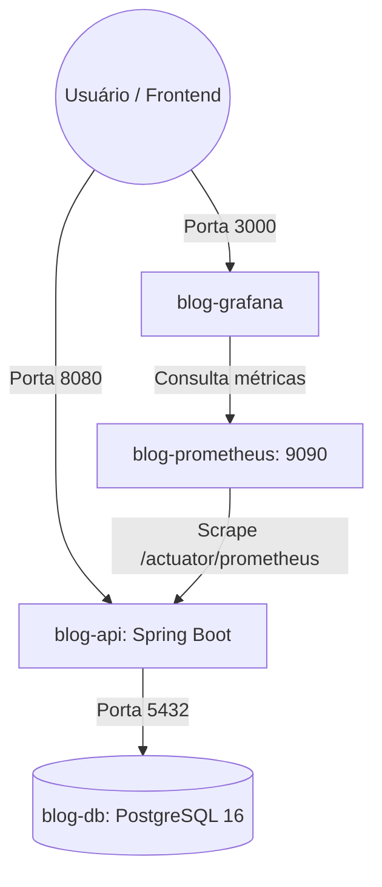

# ⚙️ Especificação Técnica: Infraestrutura & Observabilidade

Esta especificação aborda a conteinerização com Docker, orquestração via Docker Compose, pipeline de métricas com Actuator/Prometheus/Grafana e a estratégia de testes automatizados com Testcontainers na **API Blog Pessoal**.

---

## 1. Conteinerização com Docker (Multi-Stage Build)

O [`Dockerfile`](file:///c:/Users/paulo/Documents/GitHub/api-blog-pessoal/Dockerfile) adota a técnica de **Multi-stage build** para otimizar o tamanho final da imagem e garantir segurança em produção:

```dockerfile
# Stage 1: Build
FROM gradle:8.5-jdk21-alpine AS build
WORKDIR /app
COPY . .
RUN gradle clean bootJar --no-daemon

# Stage 2: Runtime
FROM eclipse-temurin:21-jre-alpine
WORKDIR /app
COPY --from=build /app/build/libs/*.jar app.jar
EXPOSE 8080
ENTRYPOINT ["java", "-jar", "app.jar"]
```

### Vantagens do Design
- A imagem final contém apenas o **JRE Alpine (Java Runtime Environment)**, sem o compilador JDK ou ferramentas de build, reduzindo a superfície de ataque e o consumo de disco.
- Execução isolada e idempotente, independente de versões locais de Java na máquina hospedeira.

---

## 2. Orquestração com Docker Compose

O arquivo [`docker-compose.yml`](file:///c:/Users/paulo/Documents/GitHub/api-blog-pessoal/docker-compose.yml) orquestra a stack completa de serviços:



### 2.1 Serviços Configurados

| Serviço | Imagem | Porta Exposta | Descrição |
| :--- | :--- | :--- | :--- |
| `db` | `postgres:16-alpine` | `5432` | Banco relacional com volume persistente e *Healthcheck* (`pg_isready`). |
| `api` | Local (`Dockerfile`) | `8080` | Aplicação Spring Boot no perfil `prod`. Só inicia quando o banco estiver saudável (`service_healthy`). |
| `prometheus` | `prom/prometheus:latest` | `9090` | Servidor de monitoramento com coleta periódica (intervalo de 5s). |
| `grafana` | `grafana/grafana:latest` | `3000` | Painéis visuais para análise de métricas em tempo real. |

---

## 3. Observabilidade & Métricas

### 3.1 Spring Boot Actuator
Configurado no `application.yaml` para expor os seguintes endpoints de gerenciamento:
- **`/actuator/health`**: Verifica status de integridade da API, conexões de banco de dados e espaço em disco.
- **`/actuator/info`**: Exibe dados gerais da aplicação e ambiente.
- **`/actuator/prometheus`**: Endpoint com métricas no padrão OpenMetrics/Prometheus para coleta contínua.

### 3.2 Coleta com Prometheus
Configurada no arquivo `docker/prometheus/prometheus.yml`:
```yaml
global:
  scrape_interval: 5s

scrape_configs:
  - job_name: 'api-blog-pessoal'
    metrics_path: '/actuator/prometheus'
    static_configs:
      - targets: ['api:8080']
```

---

## 4. Estratégia de Testes Automatizados

A suíte de testes combina testes unitários rápidos e testes de integração com banco de dados real.

### 4.1 Testes de Integração com Testcontainers
A classe base [`AbstractIntegrationTest`](file:///c:/Users/paulo/Documents/GitHub/api-blog-pessoal/src/test/java/br/com/passos/api_blog_pessoal/AbstractIntegrationTest.java) utiliza o **Testcontainers** para instanciar um container oficial do PostgreSQL:
- Anotação `@ServiceConnection`: Injeta dinamicamente as credenciais e porta do container diretamente nas propriedades do Spring Boot.
- Anotação `@ActiveProfiles("test")`: Utiliza configurações dedicadas para testes.
- Método `@BeforeEach cleanDatabase()`: Executa `TRUNCATE TABLE ... RESTART IDENTITY CASCADE` antes de cada método de teste, assegurando isolamento total.

### 4.2 Camadas Testadas
- **Controllers (Testes de Integração):** `CategoriaControllerIT`, `ComentarioControllerIT`, `PostControllerIT`, `TagControllerIT`, `UsuarioControllerIT` usando `TestRestTemplate`.
- **Services (Testes Unitários com Mockito):** Validação isolada de regras de negócio, fluxos alternativos e lançamentos de exceções.
- **Validadores de Negócio:** Testes dedicados para cada estratégia de validação (`ValidadorPostAutorNaoEhAdminTest`, `ValidadorComentarioAutorNaoEhAdminTest`).
