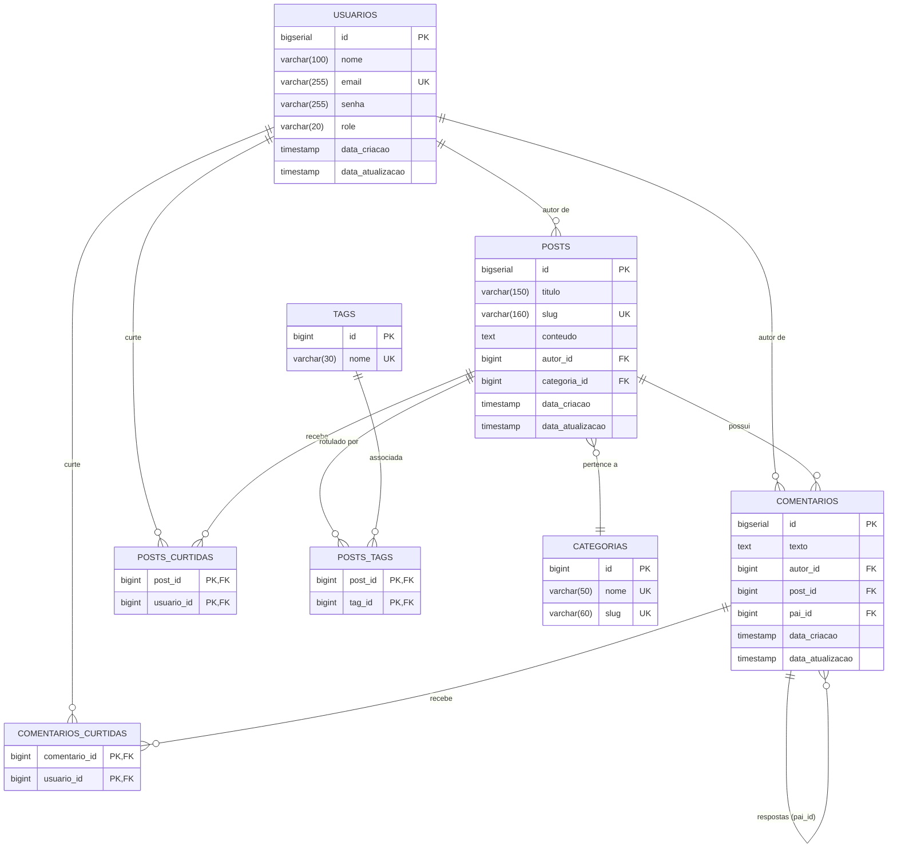
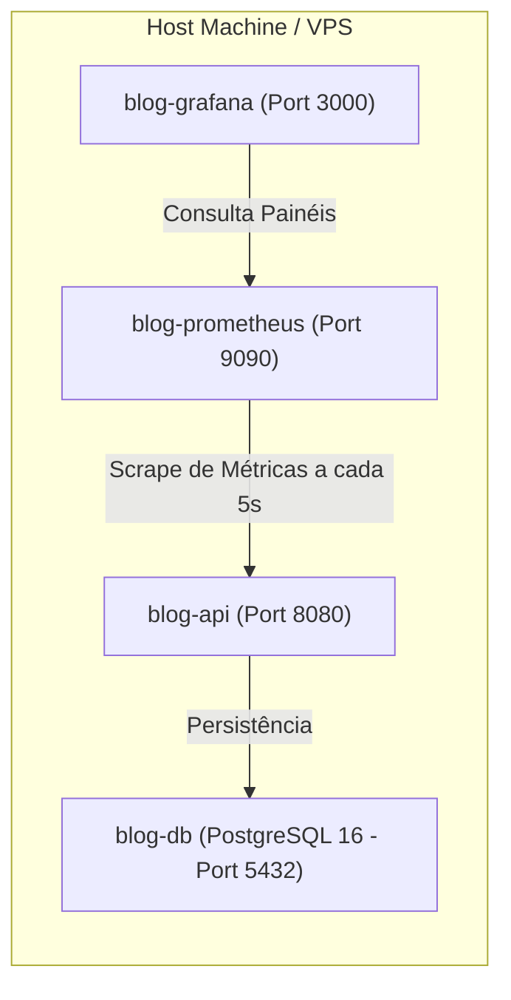

# 📘 Documentação Completa do Projeto: API Blog Pessoal

> **Versão da Aplicação:** 1.0.0  
> **Framework:** Spring Boot 3.5.14 | **Linguagem:** Java 21 (LTS)  
> **Autor:** Paulo Passos | **Licença:** Apache 2.0  
> **Documento Consolidado:** Especificação Técnica Unificada de Arquitetura, Banco de Dados, Endpoints, Negócio e Infraestrutura.

---

## 📑 Índice
1. [Visão Geral & Objetivos](#1-visão-geral--objetivos)
2. [Arquitetura & Decisões Técnicas](#2-arquitetura--decisões-técnicas)
3. [Modelagem de Dados & Migrações Flyway](#3-modelagem-de-dados--migrações-flyway)
4. [Matriz Completa de Endpoints REST](#4-matriz-completa-de-endpoints-rest)
5. [Especificação Funcional por Módulo](#5-especificação-funcional-por-módulo)
   - [5.1 Módulo de Usuários](#51-módulo-de-usuários)
   - [5.2 Módulo de Posts & Feed Otimizado](#52-módulo-de-posts--feed-otimizado)
   - [5.3 Módulo de Comentários Hierárquicos](#53-módulo-de-comentários-hierárquicos)
   - [5.4 Módulo de Categorias & Tags](#54-módulo-de-categorias--tags)
6. [Tratamento Global de Erros & Validações](#6-tratamento-global-de-erros--validações)
7. [Hipermídia HATEOAS & Navegabilidade](#7-hipermídia-hateoas--navegabilidade)
8. [Infraestrutura, Docker & Observabilidade](#8-infraestrutura-docker--observabilidade)
9. [Guia de Execução & Testes](#9-guia-de-execução--testes)

---

## 1. Visão Geral & Objetivos

A **API Blog Pessoal** é uma aplicação backend RESTful de alto desempenho projetada para suportar plataformas de publicação de conteúdo (blogs pessoais e artigos técnicos). O projeto prioriza:
- **Resiliência e Performance em VPS:** Otimização agressiva de queries e consumo de memória (eliminação de `COUNT(*)` via Spring Data `Slice` e paginação por cursor).
- **Separação Rígida de Responsabilidades:** Camadas bem delimitadas (Controller → Service → Repository), separação absoluta entre `@Entity` e DTOs `record`, conversões estáticas com MapStruct.
- **Auditoria e Integridade:** Auditoria temporal automatizada (`@CreatedDate`, `@LastModifiedDate`), versionamento de schema via Flyway e constraints relacionais rígidas.
- **Navegabilidade e Documentação:** Respostas enriquecidas com hipermídia HATEOAS e especificações OpenAPI 3.0 interativas via Swagger UI.

---

## 2. Arquitetura & Decisões Técnicas

### 2.1 Stack Tecnológica

| Componente | Especificação | Justificativa |
| :--- | :--- | :--- |
| **Linguagem** | Java 21 (LTS) | Uso nativo de Records, pattern matching e virtual threads. |
| **Framework** | Spring Boot 3.5.14 | Auto-configuração, injeção de dependências e maturidade produtiva. |
| **Mapeamento Objeto-Relacional** | Spring Data JPA / Hibernate 6 | Abstração padronizada de persistência e JPA Specifications. |
| **Controle de Schema** | Flyway Core + PostgreSQL | Migrações versionadas, reprodutíveis e rastreáveis via código. |
| **Transformação de Dados** | MapStruct 1.6.3 | Mapeamento compile-time sem reflexão, de altíssima performance. |
| **Design Hipermídia** | Spring HATEOAS | Conformidade com o nível 3 do Modelo de Maturidade de Richardson. |
| **Documentação da API** | SpringDoc OpenAPI 2.8.5 | Geração dinâmica de especificações e UI para testes interativos. |
| **Métricas & Telemetria** | Spring Boot Actuator + Micrometer | Exposição de métricas de runtime para coleta com Prometheus. |
| **Testes Automatizados** | JUnit 5 + Mockito + Testcontainers | Testes de serviço isolados e testes de integração com PostgreSQL real. |

### 2.2 Estrutura de Pacotes

```
br.com.passos.api_blog_pessoal
├── assembler/                 # Assemblers HATEOAS (links de navegação)
├── config/                    # Configurações de CORS, Auditoria e OpenAPI
├── controller/                # Controladores REST da API
├── dto/                       # DTOs imutáveis representados por Java Records
├── exception/                 # Manipulador global de erros e contratos HTTP
├── mapper/                    # Mappers MapStruct gerados em compilação
├── model/                     # Entidades persistentes do JPA / Hibernate
├── repository/                # Interfaces de repositório e JPA Specifications
├── service/                   # Regras de negócio, transações e orquestração
│   └── validation/            # Validadores desacoplados (Strategy Pattern)
└── util/                      # Utilitários de domínio (ex: normalização de slug)
```

---

## 3. Modelagem de Dados & Migrações Flyway

### 3.1 Diagrama Entidade-Relacionamento (ERD)



### 3.2 Linha do Tempo das Migrações Flyway

1. **`V1__create_table_usuarios.sql`**: Tabela `usuarios` com campos obrigatórios, constraint de e-mail único e colunas temporais de auditoria.
2. **`V2__create_tables_posts_comentarios.sql`**: Tabelas fundamentais de `posts` e `comentarios` com chaves estrangeiras para o autor e deleção em cascata (`ON DELETE CASCADE`) entre posts e comentários.
3. **`V3__add_categories_tags_and_slug.sql`**: Tabelas `categorias`, `tags` e `posts_tags`. Adiciona slug único amigável e relacionamento opcional de categoria na tabela `posts`.
4. **`V4__add_likes_and_threaded_comments.sql`**: Introduz o auto-relacionamento `pai_id` em comentários (para respostas aninhadas) e cria tabelas associativas de curtidas (`posts_curtidas` e `comentarios_curtidas`).
5. **`V5__insert_dados_teste.sql`**: Seed de dados iniciais compatível com H2 e PostgreSQL (usuário de teste, categorias, tags, posts de exemplo e comentários associados).

---

## 4. Matriz Completa de Endpoints REST

| Método | Caminho | Resumo / Função | Permissão | Status Sucesso |
| :--- | :--- | :--- | :--- | :--- |
| `POST` | `/api/v1/usuarios` | Cadastra um novo usuário no sistema | Livre | `201 Created` |
| `GET` | `/api/v1/usuarios/busca-por-email` | Busca usuário pelo e-mail exato | Livre | `200 OK` |
| `GET` | `/api/v1/usuarios/busca-por-nome` | Busca usuários por trecho do nome (case-insensitive) | Livre | `200 OK` |
| `PUT` | `/api/v1/usuarios/{id}` | Atualiza dados cadastrais de um usuário | `ADMIN` (`executorId`) | `200 OK` |
| `DELETE` | `/api/v1/usuarios/{id}` | Remove permanentemente um usuário | `ADMIN` (`executorId`) | `204 No Content` |
| `POST` | `/api/v1/posts` | Cria uma nova publicação | `USER` (`autorId`) | `201 Created` |
| `GET` | `/api/v1/posts/feed` | Feed paginado por cursor (Keyset Pagination) | Livre | `200 OK` |
| `GET` | `/api/v1/posts` | Lista todas as publicações cadastradas | Livre | `200 OK` |
| `GET` | `/api/v1/posts/{id}` | Recupera post completo por ID | Livre | `200 OK` |
| `GET` | `/api/v1/posts/slug/{slug}` | Recupera post completo por slug textual amigável | Livre | `200 OK` |
| `GET` | `/api/v1/posts/search` | Pesquisa posts por título, conteúdo, categoria ou tag | Livre | `200 OK` |
| `PUT` | `/api/v1/posts/{id}` | Atualiza post (apenas o autor proprietário) | `USER` (autor do post) | `200 OK` |
| `DELETE` | `/api/v1/posts/{id}` | Exclui post e seus comentários (apenas o autor) | `USER` (autor do post) | `204 No Content` |
| `POST` | `/api/v1/posts/{id}/curtir` | Alterna curtida no post (toggle curtir/descurtir) | Qualquer usuário | `200 OK` |
| `POST` | `/api/v1/posts/{postId}/comentarios` | Adiciona comentário a um post | `USER` (`autorId`) | `201 Created` |
| `GET` | `/api/v1/posts/{postId}/comentarios` | Lista árvore hierárquica de comentários do post | Livre | `200 OK` |
| `POST` | `/api/v1/comentarios/{id}/respostas` | Envia resposta aninhada a um comentário existente | `USER` (`autorId`) | `201 Created` |
| `POST` | `/api/v1/comentarios/{id}/curtir` | Alterna curtida no comentário (toggle) | Qualquer usuário | `200 OK` |
| `POST` | `/api/v1/categorias` | Cadastra uma nova categoria | Livre | `201 Created` |
| `GET` | `/api/v1/categorias` | Lista todas as categorias cadastradas | Livre | `200 OK` |
| `GET` | `/api/v1/tags` | Lista todas as tags cadastradas | Livre | `200 OK` |
| `GET` | `/actuator/health` | Status de integridade e dependências da aplicação | Livre | `200 OK` |
| `GET` | `/actuator/info` | Informações de ambiente e build | Livre | `200 OK` |
| `GET` | `/actuator/prometheus` | Métricas formatadas para coleta do Prometheus | Livre | `200 OK` |

---

## 5. Especificação Funcional por Módulo

### 5.1 Módulo de Usuários
- **Segurança de perfis:** Administradores (`ADMIN`) gerenciam os usuários, enquanto usuários comuns (`USER`) são os produtores de conteúdo.
- **Unicidade de e-mail:** Não são permitidos registros duplicados nem a atualização para um e-mail já existente. Retorna HTTP 409 em conflitos.
- **DTOs Utilizados:**
  - `UsuarioRequest`: `nome`, `email`, `senha`, `role`.
  - `UsuarioUpdateRequest`: `nome`, `email`, `role`.
  - `UsuarioResponse`: `id`, `nome`, `email`, `role`, `dataCriacao`.

### 5.2 Módulo de Posts & Feed Otimizado
- **Restrição de autoria:** Apenas contas com papel `USER` podem publicar posts, validado na camada de serviço pela estratégia `ValidadorPostAutorNaoEhAdmin`.
- **Validação de propriedade:** Um post só pode ser modificado ou excluído pelo mesmo usuário que o criou.
- **Slugs únicos:** Conversão automática de títulos em slugs URL-friendly (ex: `Meu Primeiro Post` → `meu-primeiro-post`). Conflitos são resolvidos com sufixos incrementais (`meu-primeiro-post-1`).
- **Cálculo de leitura:** Baseado no ritmo de 200 palavras por minuto ($T = \lceil palavras / 200 \rceil$), calculado pelo `PostMapper`.
- **Feed de Alta Performance:**
  - Keyset pagination baseada em `lastId`: Evita queries de `OFFSET` lentas em grandes volumes de dados.
  - Uso de `Slice`: Suprime consultas de contagem de páginas para poupar memória e CPU.
  - Projeção otimizada: Retorna `PostFeedResponse` gerando o resumo com `SUBSTRING(p.conteudo, 1, 200)` direto no PostgreSQL/H2.
- **Busca dinâmica:** Utiliza `PostSpecifications` com escape seguro de caracteres coringa (`%`, `_`, `\`) contra injeção e buscas ambíguas.

### 5.3 Módulo de Comentários Hierárquicos
- **Threaded Comments:** Suporte a respostas aninhadas utilizando auto-relacionamento `pai_id`.
- **Listagem Otimizada:** O endpoint de listagem traz os comentários-raiz (`pai_id IS NULL`), com suas respectivas respostas embutidas recursivamente na propriedade `respostas`.
- **Restrição de comentários:** Administradores são moderadores e não comentam; somente o papel `USER` pode comentar ou responder (`ValidadorComentarioAutorNaoEhAdmin`).
- **Sistema de Curtidas:** Tanto posts quanto comentários contam com sistema de toggle de curtidas com integridade relacional.

### 5.4 Módulo de Categorias & Tags
- **Categorias:** Nomes únicos com slug gerado automaticamente no cadastro.
- **Tags On-Demand:** Criação dinâmica via `tagService.buscarOuCriar(nome)`: ao salvar um post contendo novas tags, o sistema automaticamente cadastra as tags inexistentes e vincula as já cadastradas.

---

## 6. Tratamento Global de Erros & Validações

Centralizado na classe [`GlobalExceptionHandler`](file:///c:/Users/paulo/Documents/GitHub/api-blog-pessoal/src/main/java/br/com/passos/api_blog_pessoal/exception/GlobalExceptionHandler.java) com `@RestControllerAdvice`.

### Estrutura do DTO de Erro (`ErrorResponse`)
```json
{
  "timestamp": "2026-09-12 15:30:00",
  "status": 400,
  "error": "Erro de validação de campos",
  "message": "Um ou mais campos estão inválidos",
  "path": "/api/v1/posts",
  "details": {
    "titulo": "O título deve ter no mínimo 5 caracteres"
  }
}
```

---

## 7. Hipermídia HATEOAS & Navegabilidade

A API implementa o modelo de Maturidade de Richardson Nível 3, encapsulando os recursos em `EntityModel<T>` e `CollectionModel<EntityModel<T>>` através de Assemblers dedicados:

- **`UsuarioAssembler`:** Adiciona links `self` e link contextual `busca-por-nome`.
- **`PostAssembler`:** Inclui links `self`, `posts` (para voltar à listagem) e a ação transacional `curtir`.
- **`PostFeedAssembler`:** Links de navegação para os itens individuais do feed.
- **`ComentarioAssembler`:** Fornece links de ação para `responder` e `curtir` diretamente na resposta do comentário.
- **`CategoriaAssembler` & `TagAssembler`:** Fornecem links para as coleções correspondentes.

---

## 8. Infraestrutura, Docker & Observabilidade

### 8.1 Docker Multi-Stage Build
A imagem da API é compilada com Gradle 8.5 e executada sobre um container leve `eclipse-temurin:21-jre-alpine`, garantindo segurança e economia de disco.

### 8.2 Topologia do Docker Compose



### 8.3 Observabilidade & Métricas
- Coleta periódica a cada 5 segundos pelo Prometheus no endpoint `/actuator/prometheus`.
- Dashboards prontos no Grafana para visualização de taxa de requisições, latência e consumo de memória da JVM.

---

## 9. Guia de Execução & Testes

### 9.1 Execução em Modo de Desenvolvimento (H2)
```bash
# Executa a aplicação com perfil 'dev' e banco em memória H2
./gradlew bootRun
```
- API: `http://localhost:8080`
- Swagger UI: `http://localhost:8080/swagger-ui.html`
- Console H2: `http://localhost:8080/h2-console` (JDBC URL: `jdbc:h2:mem:blogdb`, User: `sa`, Senha: em branco)

### 9.2 Execução em Modo de Produção (Docker Compose)
```bash
# Subir toda a infraestrutura (PostgreSQL, API, Prometheus e Grafana)
docker-compose up -d --build
```
- API: `http://localhost:8080`
- Prometheus: `http://localhost:9090`
- Grafana: `http://localhost:3000` (Login: `admin` / Senha: `admin`)

### 9.3 Execução dos Testes Automatizados
```bash
# Executa testes unitários e testes de integração com Testcontainers
./gradlew test
```
*Nota: É necessário ter o daemon do Docker em execução para a inicialização dos containers de teste.*
